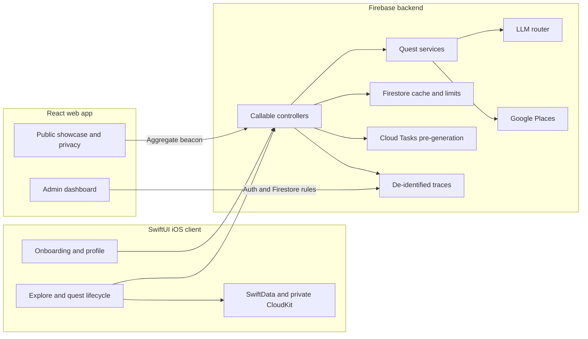

# Horizon

**A full-stack iPhone app that turns the edges of a user's comfort zone into
small, real-world quests.**

[Website](https://usehorizon.app) ·
[TestFlight](https://testflight.apple.com/join/brUjqFkr) ·
[Privacy](https://usehorizon.app/privacy)


Horizon asks what makes someone hesitate, along with their interests, city,
budget, and transportation constraints. It uses that context to generate a
small set of practical quests—often tied to real nearby places—then gives the
user a private space to commit to one, complete it, and reflect with photos and
a journal entry.

This repository contains the complete product: the native iOS application, its
serverless generation backend, the public website, and an internal operations
dashboard.

## Product flow

1. **Onboarding** identifies comfort-zone edges and practical preferences.
2. **Explore** presents generated quests in a nondestructive swipe deck.
3. **Quest** holds one active commitment, with place and travel context when
   relevant.
4. **Completion and Logbook** preserve photos and reflections in the user's
   private SwiftData/CloudKit store.

The product is intentionally not a social network: there are no feeds, public
profiles, streaks, or engagement mechanics. The focus is choosing an action and
following through.

## Engineering scope

| Domain | Technologies | Responsibility in Horizon |
| --- | --- | --- |
| Native iOS | Swift, SwiftUI, SwiftData, CloudKit, MapKit | Onboarding, quest discovery, lifecycle state, offline content, photos, journaling, and native platform integration |
| Backend and AI | TypeScript, Firebase Cloud Functions, Firestore, Cloud Tasks, Vercel AI SDK, Zod, Google Places | Authenticated generation APIs, place resolution, model routing, pre-generation, rate limiting, and observability |
| Web frontend | React, Vite, Tailwind CSS, Motion | Public product showcase, privacy policy, responsive interactions, and aggregate website analytics |
| Internal tooling and delivery | Firebase Auth, App Check, Secret Manager, Firestore Rules, GitHub Actions | Admin authorization, operational dashboards, secret binding, deployment, and environment safeguards |

## iOS application — Swift and SwiftUI

The iOS client is a native SwiftUI application organized around SwiftData
models, focused screen models, and small services for external work.

- **Local-first persistence.** `UserProfile` and `Quest` live in SwiftData and
  mirror to the user's private CloudKit database. Existing quests and the
  logbook remain usable offline; location and journal photos use external
  storage on the models rather than a parallel file-management layer.
- **Explicit lifecycle rules.** Model and screen logic enforce one active quest,
  nondestructive left swipes, safe swapping, separate replacement lanes for
  curated and user-described quests, and append-only onboarding generation.
- **Typed async service boundary.** Codable request/response types isolate the
  Firebase callable contract. The service establishes anonymous Auth, maps
  transport and Functions failures into app-level errors, reconciles server
  retry times, and decodes place photos once for persistent offline display.
- **Structured concurrency.** An actor coalesces concurrent anonymous sign-in
  attempts, while the first generation runs independently of the onboarding
  walkthrough so network latency does not block product education.
- **Native platform work.** The app uses MapKit city search and maps, camera and
  photo-library capture, App Check debug/App Attest modes, typed navigation,
  adaptive SwiftUI layouts, and light/dark design tokens.

More detail: [`ios/docs/architecture.md`](ios/docs/architecture.md) and
[`ios/docs/design.md`](ios/docs/design.md).

## Backend — TypeScript and Firebase

The backend is a Firebase Cloud Functions gen 2 service on Node 22. Its deployed
surface includes two authenticated quest-generation callables, a Cloud Tasks
worker that prepares the next curated batch, and an aggregate marketing-metrics
endpoint.

- **Clear system boundaries.** Firebase concerns stay in controllers, quest
  orchestration stays in framework-light services, and Firestore, Places, and
  model providers sit behind integrations. Pure validation, distance, hashing,
  schema, prompt, and rate-limit logic can be tested without live services.
- **Cache-first generation.** A curated request can consume a profile-matched,
  TTL-validated Firestore batch. The next batch is produced asynchronously by a
  Cloud Task; a cache or queue miss remains correct because synchronous
  generation is always available.
- **Failure-safe quotas.** Requests validate before spend, reserve a short
  transactional pending slot, and commit the rolling 24-hour stamp only after
  delivery. Failures release the reservation or allow it to expire, preventing
  a failed request from consuming the user's daily opportunity.
- **Provider-aware model routing.** Structured outputs are validated with Zod,
  candidate models are ordered by recorded quota headroom, and transient or
  schema failures move to the next provider. SDK retries are disabled so the
  router—not a hidden retry loop—owns failover behavior.
- **Graceful degradation.** Missing Places results are dropped, generic quests
  fill a short batch, unresolved described locations fall back to a
  location-free quest, photo attachment is best-effort, and pre-generation
  failure does not fail the current request.
- **Privacy-aware observability.** Request-scoped traces capture pipeline timing
  and provider attempts while excluding stable identities, profile hashes,
  additional context, rendered prompts, and media bytes. The documentation
  calls this data de-identified rather than claiming it is fully anonymous.

More detail: [`docs/backend/architecture.md`](docs/backend/architecture.md),
[`docs/backend/observability.md`](docs/backend/observability.md), and the
canonical [`API contract`](docs/api/api-contracts.md).

## Web frontend — React and Vite

The web application serves three deliberately different surfaces from one
React/Vite project:

- **`/` — public showcase.** A responsive marketing page uses a scroll-driven
  iPhone walkthrough, real product media, reduced-motion support, and a focused
  path from product explanation to TestFlight.
- **`/privacy` — product policy.** A lightweight, Firebase-free route explains
  the app and website data boundaries in plain language.
- **`/admin` — operations console.** A protected dashboard presents generation
  outcomes, latency distributions, pipeline stages, Maps resolution,
  cache/fallback/failover behavior, model usage, recent errors, paginated logs,
  and per-request span waterfalls.

Firebase and the admin application are lazy-loaded and isolated into separate
build chunks, so public visitors do not download the internal data stack.
Google sign-in establishes the operator identity, while Firestore rules and the
`admins/{uid}` allowlist remain the authorization boundary.

The public site avoids third-party analytics SDKs. A same-origin beacon updates
aggregate daily counters for page views, visits, downloads, device class, and
referrer hostname without storing cookies, IP addresses, user IDs, or individual
visitor records.

More detail: [`hosting/AGENTS.md`](hosting/AGENTS.md) and
[`docs/operations/admin-dashboard.md`](docs/operations/admin-dashboard.md).

## System overview



## Repository structure

```text
ios/            SwiftUI application and iOS-specific documentation
functions/      TypeScript Cloud Functions, tests, and provider integrations
hosting/        React/Vite public site and admin dashboard
firestore/      Security rules and composite indexes
extensions/     Firebase extension configuration
docs/           Backend, API, operations, and roadmap references
```

Codex-oriented repository guidance begins in [`AGENTS.md`](AGENTS.md), with
focused instruction files inside each application subtree.

## Run and verify

The backend and hosting applications use separate lockfiles and toolchains.
From the repository root:

```bash
# Backend — Node 22 and Yarn 1
corepack yarn --cwd functions install --frozen-lockfile
corepack yarn --cwd functions test --runInBand
corepack yarn --cwd functions build

# Web — Node 22 and npm
npm --prefix hosting ci
npm --prefix hosting test
npm --prefix hosting run typecheck
npm --prefix hosting run build
```

For iOS, open `ios/horizon.xcodeproj` in full Xcode and run the `horizon` scheme
on an iPhone simulator or physical device. The command-line build is documented
in [`ios/README.md`](ios/README.md).

Operational setup, secrets, and external release state are intentionally kept
out of this overview. They live under [`docs/operations/`](docs/operations/).
